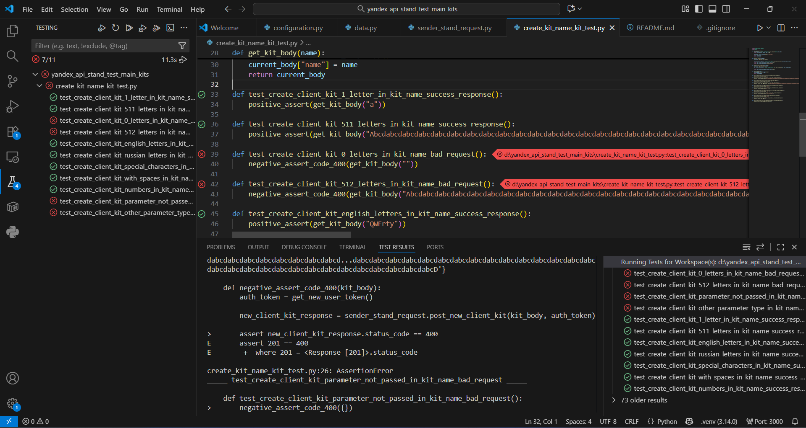

# Проект автотестов для API создания наборов

Этот проект содержит автотесты для проверки функциональности создания наборов через API.


**GitHub:** https://github.com/Ecaterina-Gavrilenko/yandex_api_stand_test_main_kits

## Структура проекта

- `configuration.py` - конфигурационные параметры
- `sender_stand_request.py` - модуль с функциями для отправки HTTP-запросов к API
- `data.py` - модуль с тестовыми данными (тело пользователя и тела наборов)
- `create_kit_name_kit_test.py` - основной файл с тестовыми случаями
- `README.md` - документация проекта

## Описание тестов

Проект содержит следующие тестовые случаи:

### Позитивные тесты (успешное создание набора)
1. **Допустимое количество символов (1)** - проверка создания набора с именем из 1 символа
2. **Допустимое количество символов (511)** - проверка граничного значения (максимально допустимая длина)
3. **Разрешены английские буквы** - проверка поддержки английского алфавита
4. **Разрешены русские буквы** - проверка поддержки кириллицы
5. **Разрешены спецсимволы** - проверка обработки специальных символов
6. **Разрешены пробелы** - проверка обработки пробелов
7. **Разрешены цифрыа** - проверка числовых значений

### Негативные тесты (ожидается ошибка 400)
8. **Количество символов меньше допустимого (0)** - проверка валидации пустого имени
9. **Количество символов больше допустимого (512)** - проверка превышения максимальной длины
10. **Параметр не передан в запросе** - проверка обязательности параметра name
11. **Передан другой тип параметра (число)** - проверка валидации типа данных

### Запуск всех тестов
Запуск тестов с помошью расширения pytest в IDE 


Через терминал
```bash
python -m pytest create_kit_name_kit_test.py -v